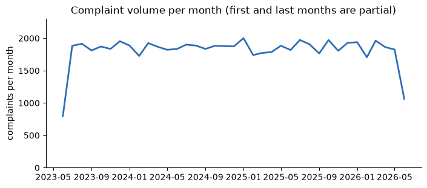
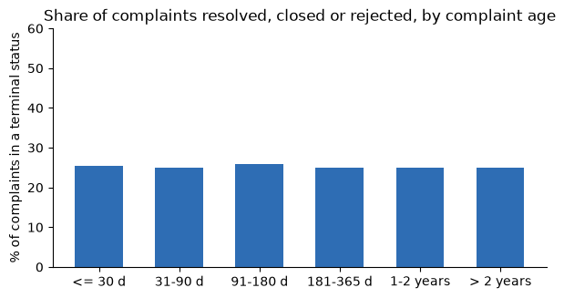
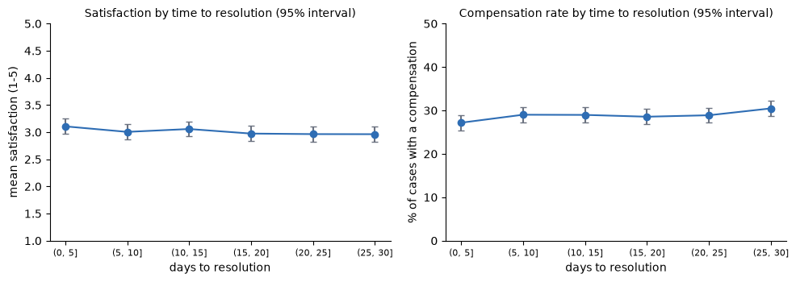
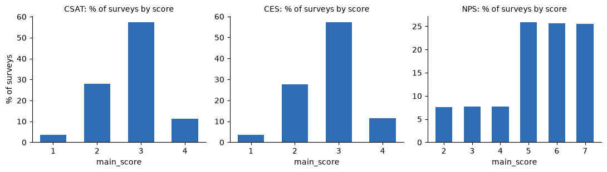
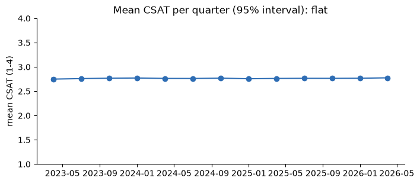
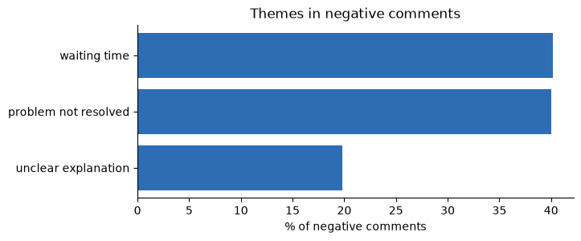

# Findings log: agentic complaint workflow, compensation and satisfaction

> **Business opportunities across all hypotheses, graded by evidence:** see [../FINDINGS.md](../FINDINGS.md).

_Last updated: 2026-09-26 · Datasets covered so far: `complaints` and `satisfaction_surveys` (both 2023-06-17 to 2026-06-17, 1,097 daily files each)_

Every number here comes from the executed notebooks [complaints.ipynb](complaints.ipynb) and [satisfaction_surveys.ipynb](satisfaction_surveys.ipynb). When a new dataset is
analysed (interactions, customer outcomes...), add a row to the status table and a section below.

---

## TL;DR

| Question | Answer today |
|---|---|
| Is there an opportunity for an agentic workflow that resolves complaints better and faster? | **Plausible, not demonstrated.** At face value the queue is large, slow and undifferentiated, but the data cannot confirm the queue is real, cannot size the benefit, and has no text to evaluate an agent on. |
| How much compensation is granted? | **4,641 grants** (6.9% of complaints; 28.8% of resolved/closed), **1,174,810 raw units** in total (mean 253, range 10-500). No currency on compensation. |
| How satisfied are customers? | Mean **3.02 / 5**, but only **3.7% of complaints are rated** (only `Closed` cases), and scores are uniform (~20% each). |
| Are compensation and satisfaction related to time-to-resolution? | **No.** Satisfaction, compensation rate and compensation amount are all flat across resolution-time bands; compensation does not raise satisfaction. |
| Do the 212,759 satisfaction surveys change that? | **No.** With ~85x more ratings (212,759 vs 2,484) the result holds at customer and agent level (rho -0.02 and -0.01), so sample size was not the reason. Surveys cannot be linked to complaints at the interaction level. |
| Why do customers give ratings of 1, 2 or 3? | **Only 47.5% state a reason**, all from five negative sentences: waiting time 40.2%, problem not resolved 40.0%, unclear explanation 19.8%. No other variable explains low ratings (channel, agent, customer, response time...). The comments are a weak signal. |
| What do low ratings citing waiting time or an unresolved problem cost? | **Value at stake is large, observed cost is zero within noise.** 15,715 customers tie ~15.6 M USD-eq a year of interest income proxy (10.5% of the base) and 223.8 M of balances, but they are no more likely to leave, transact less, complain or contact again than customers who gave the top score. Churn itself cannot be identified. |
| Next step? | Confirm with the system owners whether the ~75% active backlog is real; instrument time-in-state, effort and CSAT; then pilot on new complaints against a control. |

**Business idea being tested:** an agentic workflow (triage, routing, first response, resolution support) could solve
complaints better and faster; and compensation / satisfaction should be quantified against time-to-resolution.

---

## 1. Status by dataset

| Dataset | Notebook | Rows | Verdict |
|---|---|---|---|
| `complaints` (all history) | [complaints.ipynb](complaints.ipynb) | 67,095 complaints, 54,145 customers, 1,200 agents | Baseline measured; opportunity plausible but unconfirmed; no relationship between time, compensation and satisfaction |
| `satisfaction_surveys` (all history) | [satisfaction_surveys.ipynb](satisfaction_surveys.ipynb) | 212,759 surveys, 113,640 customers, 1,090 agents | Scores unrelated to anything observable; no link key to complaints; NPS invalid; adds a baseline and pilot sensitivity |

---

## 2. Baseline: volume, backlog and speed

| Metric | Value |
|---|---:|
| Complaints (3 years) | 67,095 |
| Per full month (median) | 1,874 (flat, no trend) |
| **Active backlog** (Open + In Process + Escalated) | **50,269 (74.9%)** |
| ...of which older than 1 year | 33,413 |
| `Open` with no agent assigned | 20,125 |
| `Escalated` with no first response | 3,321 |
| Complaints that never had an agent | 23,115 |
| Median hours to assignment / first response | 12 / 38 |
| Median days to resolution (resolved cases) | 16 |
| Share of resolution time spent waiting for the first response | ~10% |

The process does not differentiate cases: **Critical takes as long as Low** (15.5 vs 15.7 days), a `Regulator`
complaint takes as long as any other, and resolution time is unrelated to category, channel or case type. Agents
are interchangeable: the spread of their average resolution time (2.44 days) equals what chance gives with identical agents (2.42).

### Can we trust the backlog?

The share of complaints that are resolved, closed or rejected is ~25% **at every age**, last month's complaints
as much as those from 2023. In a real queue, older complaints are far more likely to be resolved. So either the real backlog is
enormous, or statuses were assigned at random. **This decides whether the opportunity is real** and must be confirmed with the owners.

---

## 3. Compensation granted

| | |
|---|---:|
| Grants | 4,641 (6.9% of complaints; 28.8% of Resolved + Closed) |
| Total granted (raw units, no currency) | 1,174,810 |
| Mean / median per grant | 253 / 253 (range 10-500) |
| Median grant as a share of the claimed amount | 10% (only 1,453 grants have a claim; 62 exceed it) |

Compensation looks **arbitrary**: 27-31% are granted whatever the resolution text (including the one that says
"compensation granted"), category, priority or case type; the amount does not follow the claim (Spearman 0.03). The
`Regulator` channel is the only outlier (36.5% on 181 cases, barely beyond noise). Compensated customers are not
less likely to be inactive today (14.2% not `Active` in both groups; a cross-sectional check only).

**The unit is unknown.** Compensation has no currency column, and the amounts are 10-500 in every claim currency.

---

## 4. Satisfaction, and relations with time-to-resolution

| Check | Result |
|---|---|
| Ratings | 2,484 (3.7% of complaints, 95% of `Closed`, none on `Resolved`) |
| Mean rating | 3.02 +/- 0.06; scores 1-5 hold ~20% each |
| Satisfaction, fastest (0-5 d) vs slowest (25-30 d) band | 3.11 vs 2.96 (0.15 drift, within +/-0.14 noise per band) |
| Spearman: days to resolution vs satisfaction | -0.03 |
| Compensated vs not | 3.00 vs 3.02 (+/-0.13) |
| SLA breached vs not | 2.99 vs 3.02 (+/-0.14) |
| Compensation rate by resolution-time band | 27-30% in every band; mean amount 247-260 |

The sample resolves differences of about 0.13 rating points, so a quarter-point effect would have shown. This is
evidence of **no relationship inside the observed range**, not lack of data (resolved complaints only, 1-30 days: no complaint was resolved in under a day, and the 77% without a resolution time have no rating): faster resolution does not raise satisfaction, compensation does not
raise satisfaction, and slower cases are not compensated more. We cannot claim that speeding up resolution would improve
satisfaction, or that compensation buys goodwill.

---

## 5. Satisfaction surveys (212,759 surveys)

The survey file is per **interaction** and much larger than the complaint ratings (which cover 3.7% of complaints).

### 5a. Structure: three surveys, three scales

| Type | Share of surveys | Scale | Mean |
|---|---:|---|---:|
| CSAT | 60% | 1-4 | 2.77 |
| NPS | 30% | **2-7** | 5.31 |
| CES | 10% | 1-4 | 2.77 |

The NPS cannot be a real NPS: the scale stops at 7, so **no Promoter exists** and the implied NPS (-74.5, 74.5% Detractors
of categorised surveys) is an artefact of the scale. The three follow-up questions are uniform 1-5 and independent of the
score; a comment is written on ~47% of surveys at every score; sentiment is a function of the score band; there are only 13
distinct comments.

### 5b. Scores are driven by nothing

CSAT is 2.77 (of 4) in every channel, quarter (2.75-2.78), segment, country and customer status. The spread of agents'
average scores equals chance (0.06 vs 0.06, identical agents). Rank correlations with follow-up answers, response time and
campaign response rate are ~0.

### 5c. Themes in the comments

30% of surveys carry a negative comment: **waiting time 40%, problem not resolved 40%, unclear explanation 20%**. At face value,
half of the dissatisfaction is about speed and half about resolution. But customers who wrote "I waited too long" rate
"was the waiting time acceptable?" **3.0 of 5, the same as those who wrote "excellent attention"**, so the comments carry
nothing beyond the score band and are weak evidence.

### 5d. Link to complaints: none at interaction level

`origin_interaction_id` is empty in complaints, so there is no key. What the shared customers and agents show:

| Check | Result |
|---|---|
| Survey customers who also complain | 41,059 (36%, as in the base) |
| Survey agents that are also complaint agents | 1,090 of 1,090 |
| Same agent handled a complaint and a survey within 30 days after it | 0.12% (chance: 0.08%) |
| CSAT, customers with vs without complaints | 2.76 vs 2.77 |
| CSAT, customers with vs without a compensation (31,106 customers) | 2.77 vs 2.76 |
| Customer level: mean resolution days vs mean CSAT (8,408 customers) | rho -0.02 |
| Agent level: mean resolution days vs mean CSAT (1,084 agents) | rho -0.01 |

With this sample, **sample size was not the reason** satisfaction looked unrelated to time and compensation in the
complaint ratings. The one thing not testable is the individual interaction, because the datasets are not linked at that level.

### 5e. Baseline and pilot sensitivity

~5,900 surveys per month; mean CSAT 2.77; 31% score 1-2 and 11% score 4; 30% carry a negative comment. Smallest CSAT
difference a pilot could detect (80% power, 95% confidence, CSAT sd 0.69): **0.19** with 200 surveys per group, 0.12 with 500,
0.09 with 1,000, **0.04 with 5,000**, 0.02 with 20,000.

---

### 5f. Reasons behind ratings 1, 2 or 3

**Definition and scale warning.** "1, 2 or 3" is applied literally to `main_score`, but the scales differ: for CSAT and CES (1-4) it is almost
every survey, for NPS (2-7) it is the bottom two scores.

| Survey type | Surveys | Rated 1-3 | Share |
|---|---:|---:|---:|
| CSAT (1-4) | 127,856 | 113,381 | 88.7% |
| CES (1-4) | 21,235 | 18,781 | 88.4% |
| NPS (2-7) | 63,668 | 9,758 | 15.3% |
| **Total** | 212,759 | **141,920** | 66.7% |

Ratings 1-3 are also exactly the band the file labels `Negative` in `comment_sentiment`.

**Stated reasons (the open comment).** Of the 141,920 low ratings, **67,477 (47.5%) carry a comment and 74,443 (52.5%) record no reason**.
Every comment on a low rating is one of five negative sentences:

| Theme | Sentences | Comments | % of comments | % of all low ratings |
|---|---|---:|---:|---:|
| Waiting time | "Tardaron mucho en atenderme" (13,620), "Tuve que esperar demasiado tiempo" (13,501) | 27,121 | 40.2% | 19.1% |
| Problem not resolved | "No resolvieron mi problema completamente" (13,546), "No estoy satisfecho con la solución" (13,472) | 27,018 | 40.0% | 19.0% |
| Unclear explanation | "El agente no fue muy claro en sus explicaciones" | 13,338 | 19.8% | 9.4% |

The split is the same at each score (waiting 40.1 / 40.4 / 40.1% for scores 1 / 2 / 3), survey type and send channel: no group is more
than 1.4 points from the overall split. A rating of 1 is explained the same way as a rating of 3.

**Volume in the last 12 months (2025-06-01 to 2026-05-31):** 70,834 surveys, of which **47,086 (66.5%) rated 1-3**. Only 22,395 state a reason:
waiting time 8,977, problem not resolved 8,914, unclear explanation 4,504. For 24,691 no reason is recorded.

**Do other variables explain low ratings? No.**

| Check | Result |
|---|---|
| Follow-up answers, ratings 1-3 vs higher (quality of attention / wait acceptable / would return), by survey type | Differences of at most 0.08 on a 1-5 scale (means 2.9-3.0 everywhere) |
| Wait-time answer of customers whose comment complains about waiting | 3.00, the same as "not resolved" (3.00) and "unclear" (3.04) |
| Share rated 1-3 by send channel, quarter, segment, country, customer status, complaint history, response-time quartile, campaign-response quartile, open comment | Spread of at most 1.45 points for CSAT and 2.07 for NPS (widest interval 1.4 / 2.4), i.e. within noise |
| Agents (CSAT / NPS): spread of each agent's share rated 1-3 | 2.83 / 4.66 points against 2.94 / 4.75 expected from chance |

**Reading.** The only recorded reasons split about evenly between **speed** (waiting time, 40%) and **resolution quality** (not resolved 40% plus
unclear explanation 20%). But they should be treated as a weak signal: they exist for half of the low ratings, they reproduce the score band (every comment
on a rating of 1-3 is negative and none on higher ratings), and they do not agree with the follow-up answers.

---

### 5g. What the low ratings cost, and what a user is worth

**Approach.** Three tiers, kept apart: (1) **exposure**, the value tied to the customers behind each reason; (2) **observed consequences**, whether those
customers behave differently afterwards from customers who gave the top score; (3) **cost**, the observed difference times money per unit. Scope: CSAT
and CES surveys (both 1-4, so "above 3" is the top score 4), last 12 months (2025-06-01 to 2026-05-31). Amounts are USD-equivalent at the rates implied by
the transactions file (350 ARS/USD, 4,000 COP/USD), an assumption read off the data.

**What a user is worth: a floor, not a lifetime value.** The files hold no revenue, fees or margin, so value is built from `customers.csv`, `products.csv` and the
transactions: annual interest income proxy = credit balance x `interest_rate` (assumed annual %), plus the balances that leave with the customer.

| Per customer (150,000 customers) | Basic | Plus | Premium | Student | All |
|---|---:|---:|---:|---:|---:|
| Annual interest income proxy, mean (USD-eq) | 997 | 984 | 1,001 | 978 | **993** |
| Annual interest income proxy, median | 213 | 216 | 216 | 190 | 213 |
| Credit balance, mean | 8,464 | 8,359 | 8,505 | 8,307 | 8,434 |
| Deposit balance, mean | 5,700 | 5,706 | 5,584 | 5,769 | 5,693 |
| Transactions in the last 12 months, mean | 9.9 | 9.9 | 9.8 | 9.8 | 9.9 |
| Tenure (years) / credit score, mean | 4.0 / 600 | 4.0 / 699 | 4.0 / 797 | 4.0 / 649 | 4.0 / 647 |

Among the 86,561 customers with a credit product (57.7%), the annual interest income proxy is **1,721 on average (median 714)**. The whole base is
about **149.0 M USD-eq of annual interest income and 2,119 M of balances**. Value is the same in every segment: `Premium` customers are not worth more than
`Basic` here.

**Tier 1: exposure. Customers behind the low ratings of the last 12 months (each customer once per reason).**

| Reason | Customers | Interest income tied, per year | Credit balance | Deposits | Per customer |
|---|---:|---:|---:|---:|---:|
| Waiting time | 8,086 | 7.9 M | 67.7 M | 45.8 M | 980 |
| Problem not resolved | 8,079 | 8.2 M | 71.6 M | 45.3 M | 1,011 |
| **Either reason (each customer once)** | **15,715** | **15.6 M (10.5% of the base)** | **135.2 M** | **88.6 M** | 995 |

**If all of them churned** (a full-churn scenario, not what the data shows): **15.6 M USD-eq of interest income a year, 46.9 M over 3 years and 78.2 M over 5 years**
(undiscounted), plus 223.8 M of balances leaving. Each 1% that leaves costs about **156,000 USD-eq a year**.

**Tiers 2-3: observed consequences versus customers who gave the top score. None is distinguishable from zero.**

| Outcome | Waiting time | Problem not resolved | Top score (4) |
|---|---:|---:|---:|
| Status other than `Active` (today) | 15.00% | 14.83% | 15.05% |
| Change in transactions, 3 months after vs before (difference vs top score) | +0.02 | -0.02 | 0 |
| Filed a complaint in the next 90 days | 3.50% | 3.78% | 3.33% |
| Compensation in the next 90 days, per survey (raw units) | 0.66 | 0.75 | 0.78 |
| Another survey (repeat contact) within 30 days | 3.88% | 3.78% | 3.68% |

Extra compensation over 12 months: **-967 (+/-2,687)** raw units for waiting time and **-252 (+/-2,719)** for not resolved, i.e. zero within noise, upper bound about 1,720
and 2,467. Upper bound of interest income at stake from extra churn: about **51,000** (waiting time) and **39,000** (not resolved) USD-eq a year, under 1% of the exposure.
So the attributable cost is **zero, with those upper bounds**.

**Why a churn cost cannot be measured.** Customers with status `Closed` (2,979) or `Inactive` (14,914) hold the same value as `Active` ones (mean interest income 1,001 and 966 vs 999;
deposits 5,702 and 5,692 vs 5,695) and still transact 9.8 times a year, so status does not identify who left. The implied churn rates (0.50% a year counting `Closed`, 2.98% counting
`Closed` or `Inactive`, over 600,153 customer-years) are weak; at 2.98% the expected yearly loss on these customers would be about 466,000 USD-eq, not attributable to the ratings.

**Limits.** No fees, interchange, deposit margins, defaults, cost of funds or acquisition cost are in any file, and the interest proxy includes delinquent balances, so it can overstate
income. The dates of `customer_status` are unknown.

---

## 6. Data quality register

| Issue | Evidence | Impact |
|---|---|---|
| No free text | 5 distinct descriptions, 5 distinct resolution sentences | An agent's understanding or writing cannot be evaluated |
| `origin_interaction_id` empty | 100% missing | Cannot link complaints to the interaction that caused them |
| Terminal share independent of age | ~25% at every age band | Backlog may not be real |
| `sla_breached` unrelated to times | ~20% for every priority, resolution time and status | Cannot measure SLA performance |
| Uniform stage durations | assignment 1-24 h, first response 3-72 h, resolution 1-30 d | Looks generated, not measured |
| Affected product never belongs to the complainant | 0% ownership match (44,570 complaints name a product) | Complaints not connected to the customer's products |
| Complaints before the product opened | 18.7% | Chronology inconsistent |
| Category unrelated to product type | Same product-type mix for every category | Category cannot be validated |
| `is_repeat_complainer` does not match behaviour | Flagged and unflagged customers have the same mean complaints (1.44 vs 1.45) | Flag unusable |
| Dates after the snapshot | resolution 211, first response 70, closing 46, assignment 31 | Future events |
| Resolved before first response | 492 | Inconsistent order |
| Resolution days without a resolution date | 737 | Incomplete rows |
| No currency on compensation | column absent | Compensation cannot be converted |
| Partition / `process_date` follow a business day | 08:00 cut-over here (06:00 in transactions), all but 1 row | Convention, not a defect |
| surveys | Scales differ by type; NPS scale is 2-7 | No Promoter possible; implied NPS -74.5 | NPS unusable |
| surveys | Follow-up questions uniform 1-5 and independent of the main score | ~0 rank correlation | Questions carry no information |
| surveys | Only 13 distinct comments; sentiment set by score band | 5,079 rows with sentiment but no comment; 5,018 comments without sentiment | Text is not real feedback |
| surveys | Comment themes inconsistent with structured answers | "waited too long" rates wait question 3.0 = same as "excellent attention" | Comments unreliable as evidence |
| surveys | `survey_date` is 0-2 days after `process_date` | `survey_date` = send time + `response_time_hours` for 86% of rows | `process_date` is the send day; responses run past the last partition |
| customers | `Closed` and `Inactive` customers keep the same balances and activity as `Active` ones | Closed: mean interest income 1,001 vs 999 Active; 9.8 vs 9.9 transactions a year | Churn cannot be identified from `customer_status` |
| surveys | No link to complaints | `origin_interaction_id` empty; same-agent match within 30 days 0.12% (chance 0.08%) | Interaction-level analysis impossible |

---

## 7. Assumptions and caveats

- **Descriptive only:** no model. Differences are judged against 95% intervals.
- **"Today"** is the latest `creation_date` (2026-06-18 07:56); the file has no snapshot date.
- **Backlog** = `Open` + `In Process` + `Escalated`; `Rejected` is treated as terminal.
- **Compensation units** are raw, with no FX applied, because its currency is unknown.
- **Retention proxy** uses `customers.csv` status at an unknown date, so it is cross-sectional only.

---

## 8. Next steps

1. **Validate the backlog** with the system owners (if real, that alone is the opportunity).
2. **Instrument the process** for 1-2 months: status-history events (time in state, re-openings), agent effort/touches, and satisfaction for *all* resolved cases.
3. **Obtain** real complaint text and resolution notes, the linked interactions, compensation currency and policy, and customer outcomes after resolution (retention, later complaints).
4. **Pilot** an agent-assisted triage / first-response step on new complaints against a control group, measuring time to first response, time to resolution and satisfaction (CSAT differences of ~0.04 are detectable with 5,000 surveys per group).
5. **Fix the survey linkage**: a survey-to-interaction-to-complaint key (`origin_interaction_id` or a `complaint_id` on surveys), the survey denominator (interactions surveyed vs answered), a valid 0-10 NPS scale and real comments.

### Checklist for each new dataset

- [ ] Does it add a way to measure effort or cost per case?
- [ ] Does it add complaint text or interaction content?
- [ ] Does it join on `customer_id` / `complaint_id` / `origin_interaction_id`, and how much is lost?
- [ ] Does it show a relationship between speed, compensation and satisfaction, or is it flat again?

---

## 9. Reproduce

| Notebook | What it contains |
|---|---|
| [satisfaction_surveys.ipynb](satisfaction_surveys.ipynb) | Survey structure and scales, NPS and sentiment checks, timestamps, score drivers (channel, quarter, agent, customer), comment themes, link to complaints (customer, agent, time window, customer- and agent-level), baseline and pilot sensitivity, conclusions |
| [complaints.ipynb](complaints.ipynb) | Load (memory measured), structure and consistency checks, volume and mix, backlog and speed, compensation, satisfaction, agents and repeat complainers, joins with customers and products, baseline table, conclusions |

Data lives in `data/complaints/` and `data/satisfaction_surveys/` at the repo root (git-ignored). Both are small (17 MB and 44 MB), so they are loaded whole (~230 MB and ~260 MB of process memory).
Charts in `figures/` are exported from the executed notebook; re-export them if it changes.
