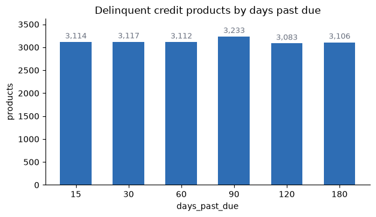
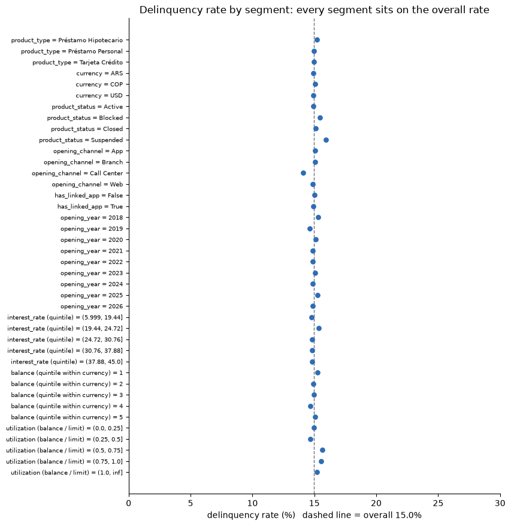
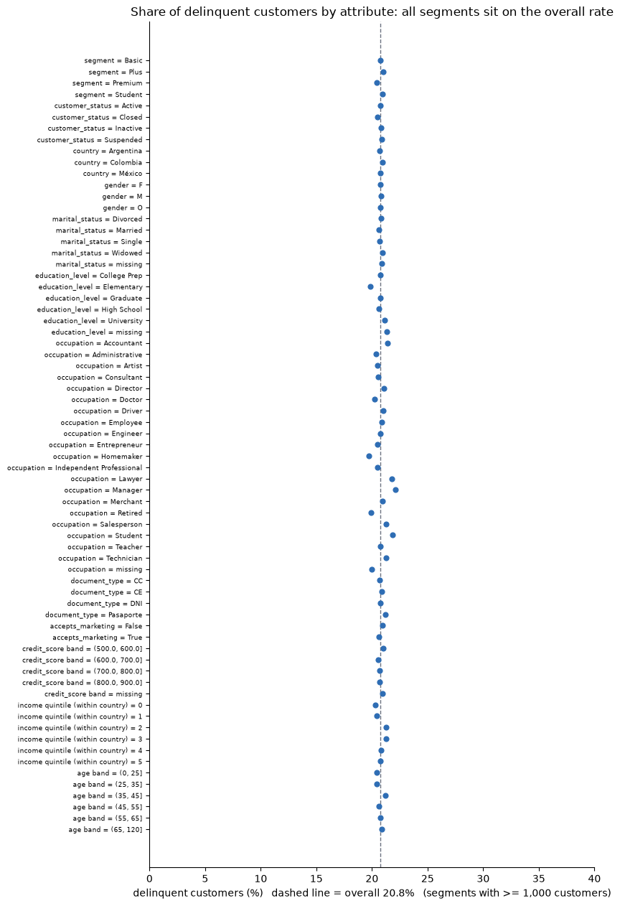
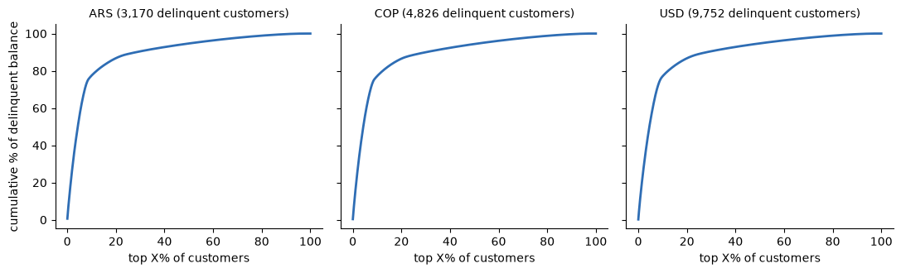
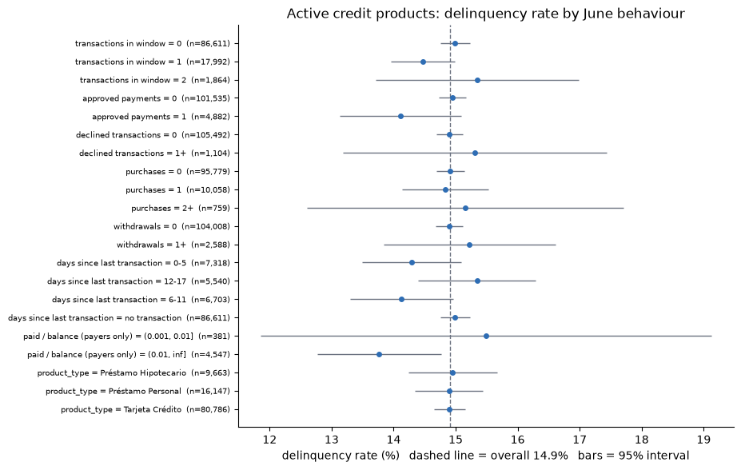
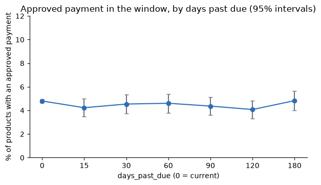
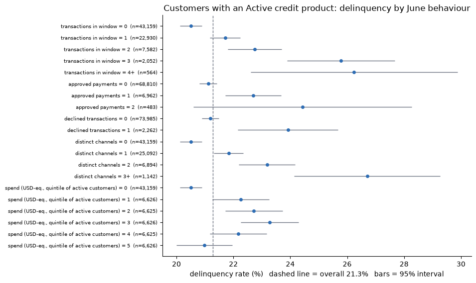
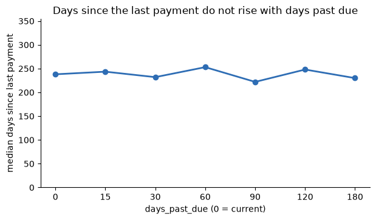
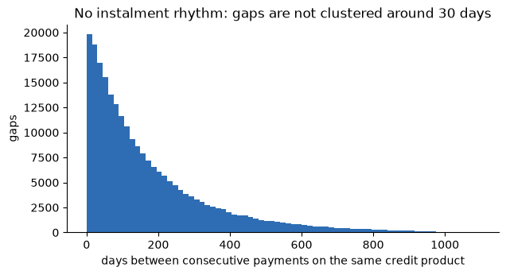
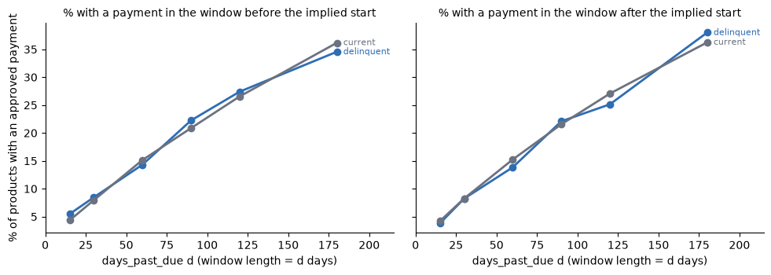

# Findings log: can we predict time-to-payment for delinquent credit?

> **Business opportunities across all hypotheses, graded by evidence:** see [../FINDINGS.md](../FINDINGS.md).

_Last updated: 2026-09-26 · Datasets covered so far: `products.csv`, `customers.csv`, `transactions` (June 2026, then the full history 2023-06 to 2026-06)_

Every number here comes from an executed notebook in this folder (see [Reproduce](#10-reproduce)).
When a new dataset is analysed, add a row to the status table, a section under "Findings by
dataset", and update the verdict.

---

## TL;DR

| Question | Answer today |
|---|---|
| Is there money at stake? | **Yes.** 18,765 delinquent credit products held by **17,650 customers** (20.8% of credit customers). |
| Can we build a time-to-payment model with the data we have? | **No.** There is no payment target, no history, and no feature (static or June behaviour) that separates who is delinquent. |
| Is there anything actionable without a model? | **Possibly.** Balance is heavily concentrated (mostly mortgages), so a value-ordered call list targets most of the money. Whether it speeds up cash is untested. |
| Did transactions help? | **They resolved FX** (350 ARS/USD, 4,000 COP/USD implied by the data) but **added no signal** and contain no repayment ledger. |
| Can "days since last payment" reveal delinquency (full history)? | **No.** Recency of the last payment is unrelated to `days_past_due`; payments arrive at random, and delinquent products pay as often as current ones. |
| What is the next step? | Obtain a **payments ledger** and **collection-action history**; fix contact data; confirm the implied FX rates. Then re-check. |

**Business idea being tested:** if we know which delinquent customers will pay soon, we send the
collections workforce to them first and increase cash flow.

---

## 1. Status by dataset

| Dataset | Notebook | Rows | Verdict for the time-to-payment idea |
|---|---|---|---|
| `products.csv` | [products.ipynb](products.ipynb) | 400,000 products, 139,578 customers | Sizes the opportunity; **cannot** support a model (no target, no signal) |
| `customers.csv` | [cutomers.ipynb](cutomers.ipynb) | 150,000 customers | **Does not change the verdict**; adds operational levers (concentration, reachability) and data-quality warnings |
| `transactions` (2026-06, days 1-17) | [transactions.ipynb](transactions.ipynb) | 70,691 transactions, 51,950 customers | **Does not change the verdict**; no behavioural signal, no repayment ledger; gives an implied FX rate |
| `transactions`, full history (2023-06-17 to 2026-06-17) | [transactions_history.ipynb](transactions_history.ipynb) | 4,425,008 transactions in 1,097 daily files | **Does not change the verdict**; last-payment recency and post-delinquency payments show no link to `days_past_due` |

---

## 2. How big is the opportunity?

Scope is the three product types that carry `days_past_due`: credit cards, personal loans and
mortgages. Everything else (savings, checking, debit, investments, insurance) has it empty.

| | Count |
|---|---|
| Credit products with a `days_past_due` value | 125,350 |
| Credit customers | 84,926 |
| **Delinquent products** (`days_past_due` > 0) | **18,765** (15.0% of credit products) |
| **Delinquent customers** (>= 1 delinquent product) | **17,650** (20.8% of credit customers) |
| Delinquent customers with >= 1 `Active` delinquent product | 15,089 |
| Credit products with no `days_past_due` (excluded, not treated as current) | 6,622 |

### Money at stake (per currency, no FX available)

The products file has COP, USD and ARS balances and **no exchange rates**, so amounts are never summed
across currencies here. (The transactions file implies fixed rates, used in section 5: at those rates the
delinquent balance is about 181.8 M USD-equivalent.) Amounts are the **total balance** on delinquent products, not the overdue
amount (which the data does not contain), so they are an upper bound on what is past due.

| Currency | Delinquent balance | Of which on `Active` products | 1% of the Active balance | Delinquent share of credit balance |
|---|---:|---:|---:|---:|
| COP | 188.9 bn | 160.5 bn | 1.60 bn | 14.6% |
| ARS | 11.4 bn | 9.6 bn | 96.3 M | 15.4% |
| USD | 102.0 M | 86.3 M | 0.86 M | 15.3% |

The "1%" column is arithmetic, not a forecast: there is no payment data from which to estimate how
much faster cash would arrive. A business case has to bring its own assumption.

### Aging profile



Each of the seven `days_past_due` values holds ~3,100 products. There is no dominant "early and
easy" segment. (In the notebook's aging table the `1-30` band is twice as large only because it
spans two values, 15 and 30.)

---

## 3. Can this data support a time-to-payment model?

Three independent conditions must hold. None does today.

| Condition | Status | Evidence |
|---|---|---|
| **A. A target exists** (when did each delinquent obligation get paid?) | ❌ | No payment date, payment amount, due date, overdue amount or collection contact in either file. `days_past_due` is how late a product is *now*, not time until payment. |
| **B. There is history** (repeated snapshots) | ❌ | One row per `product_id`, single point in time. |
| **C. Features carry signal** (delinquency varies across segments) | ❌ | Delinquency is flat everywhere; see the charts below. |

### Signal check: products

If a feature mattered, delinquency rate would differ between its segments. Every dot should sit
away from the dashed line; instead they hug it.



### Signal check: customers

Same test with customer attributes (credit score, income, age, segment, status...). Credit score
is normally the strongest predictor in real portfolios; here it shows nothing.



| Check | Result |
|---|---|
| Widest spread across segments of any customer attribute | 2.4 points (occupation, small groups); credit-score bands spread 1.4 |
| Spearman: worst `days_past_due` vs credit score / income / age | -0.01 / 0.00 / 0.00 |
| Product-level: `days_past_due` vs balance / limit / interest rate | ~0 |
| Customers with several credit products | Delinquency rate rises with product count exactly as independent chances predict (e.g. 2 products: 28.2% observed vs 27.7% expected) |

### Why we suspect the data is synthetic

This is an inference, not a proof. Real portfolios rarely show:

- `days_past_due` with **exactly seven values** (0, 15, 30, 60, 90, 120, 180) and nothing in between.
- A flat ~15% delinquency rate in every segment of every attribute.
- Twenty occupations at ~6,700 customers each, and near-perfectly uniform gender and marital status.
- Timestamps in the future and products opened before their owner registered (section 7).

**Consequence:** even if we obtained a payment ledger for *this* population, a model trained on
randomly assigned delinquency would learn nothing transferable. The real test is on real data.

---

## 4. What the customer file adds (operational, no model needed)

### 4a. Concentration of delinquent money



| Currency | Top 1% of delinquent customers hold | Top 10% hold | Top 20% hold |
|---|---:|---:|---:|
| ARS | 14.4% | 77.5% | 86.8% |
| COP | 14.7% | 77.1% | 86.5% |
| USD | 14.2% | 77.1% | 86.7% |

The knee near 10% is explained by **mortgages**: ~9% of delinquent products but ~75% of the
delinquent balance in every currency (ARS 75.4%, COP 75.2%, USD 76.2%). So a value-ordered list is
largely a "mortgage holders first" list. This is concentration in *balance*; it says nothing about
who pays sooner.

### 4b. Can we reach delinquent customers? (as recorded)

Of the 17,650 delinquent customers:

```
has a mobile number on file            ████████████████████  96.9%
has an email on file                   ████████████████████  98.0%
has a landline                         ██████████            49.6%
mobile with a VALID country prefix     ██████████            48.5%
email NOT shared with another customer █████████             45.4%
at least one usable mobile/email       ██████████████        70.7%
```

Presence overstates reachability: every Mexican mobile carries Argentina's +54 prefix (0% valid in
Mexico) and over half of customers share their email with someone else.

### 4c. Status of delinquent customers

| `customer_status` | Delinquent customers |
|---|---:|
| Active | 15,048 |
| Inactive | 1,762 |
| Suspended | 505 |
| Closed | 335 |

(15,089 in section 2 uses *product* status; 15,048 here uses *customer* status. Different
definitions, both correct.)

### 4d. Do delinquent customers hold funds with the bank?

12,625 of the 17,650 have an `Active` savings/checking account. By customer and currency:

| Currency | Delinquent customer-currency pairs | With Active deposit (same currency) | Deposit covers the whole delinquent balance | Delinquent balance in those covered cases |
|---|---:|---:|---:|---:|
| ARS | 3,170 | 2,126 | 1,564 | 0.96 bn of 11.4 bn (8.4%) |
| COP | 4,826 | 3,260 | 2,420 | 17.6 bn of 188.9 bn (9.3%) |
| USD | 9,752 | 6,434 | 4,707 | 8.7 M of 102.0 M (8.5%) |

About half of the cases are fully covered, but they are the *small* exposures (~8-9% of the
money). Whether these funds are available or usable is a legal/product question the data cannot
answer.

---

## 5. Transactions, June 2026 (days 1-17)

Only `year=2026/month=06` was analysed. The window ends on 2026-06-17, the same date used as the
snapshot proxy for `products.csv`, so behaviour and delinquency labels are **contemporaneous**:
the question is whether behaviour *differs* by delinquency, not whether it predicts it.

### 5a. Result: no difference between delinquent and current products



Among 106,596 `Active` credit products (14.9% delinquent), only 18.8% transact at all in the
window. Delinquency is 14-15% in every activity segment (transactions, purchases, withdrawals,
declines, recency, payments). One small group (2+ approved payments, n=179: 9.5% +/- 4.3) sits
below, which is what chance produces among ~24 compared segments; the 1-payment group
(n=4,882) is at 14.1% +/- 1.0.



| Approved `Payment` in the window | Products with one |
|---|---:|
| Current products (`days_past_due` = 0) | 4.8% |
| Delinquent, any level (15 to 180 days) | 4.1% to 4.8% |
| Cumulative by 17 June: current vs delinquent | 4.7% vs 4.4% |

With ~15,900 delinquent products, a real gap (for example delinquent products paying half as often)
would be clearly visible. Deeper arrears do not pay less.

### 5b. The customer-level "signal" is a product-count artefact



The chart appears to show delinquency rising with activity (20.5% with no transactions to 26.2%
with 4+). It is mechanical: customers with more products transact more and also have more chances
to hold a delinquent credit product (14.3% delinquent with 1 product vs 34.9% with 8). Holding
product count fixed, the rise disappears:

| Customers with exactly 1 credit product, by transactions in June | 0 | 1 | 2 | 3+ |
|---|---:|---:|---:|---:|
| Delinquent share | 14.8% | 14.3% | 14.3% | 15.2% |

### 5c. Is there a payment ledger in the file? No

- `Payment` appears on **all eight product types**, including savings, checking, debit cards and
  investments: it is a generic label, not repayment of a credit obligation.
- Amounts are 50-2,000 USD-equivalent for cards, personal loans and mortgages alike, uncorrelated
  with the balance (Spearman -0.04 to 0.01). No due date, no amount due.
- Time to first payment inside the window is right-censored (only 4.4% of delinquent Active
  products show any) and identical for delinquent and current products.

### 5d. What it does give us: an implied FX rate

`amount_usd` implies a **fixed 350 ARS/USD and 4,000 COP/USD** (single rows deviate under 0.1%;
daily medians are identical). This is an assumption taken from the data, not a market rate.

| Delinquent credit balance, USD-equivalent | Amount |
|---|---:|
| All delinquent products | ~181.8 M (15.1% of credit balance) |
| On `Active` products | ~153.9 M |
| of which COP / ARS / USD | 40.1 M / 27.5 M / 86.3 M |

Still total balance, not the overdue amount. Also confirmed: only `Active` products ever transact;
closed, blocked and suspended products have no activity.

---

## 6. Transactions, full history: can last-payment dates reveal delinquency?

**Idea tested:** unify all transactions, take the last approved `Payment` per product, compute
`today - last payment date`, and use it to recover delinquency and the payments made after it starts.
Run on all **1,097 daily files (2023-06-17 to 2026-06-17, no missing days, 4,425,008 transactions, no
duplicate ids)**. The notebook streams one file at a time and keeps only approved payments; it peaks
at ~246 MB of process memory and runs in about 25 seconds.

### 6a. Recency of the last payment does not track delinquency



| Check | Result |
|---|---|
| Median days since last payment, `days_past_due` 0 / 15 / 30 / 60 / 90 / 120 / 180 | 238 / 244 / 232 / 253 / 222 / 248 / 230 |
| Spearman: `days_past_due` vs days since last payment | 0.00 |
| Delinquency rate by recency (0-30, 31-90, 91-180, 181-365, 366+ days) | 14.6% / 14.8% / 15.1% / 14.9% / 15.0% |
| Delinquency rate of products that never received a payment | 14.8% |

### 6b. Payments arrive at random, not as instalments



The average gap is 175 days. Gaps of 25-35 days are 5.5% of all gaps against 5.3% expected if
payments arrived at random with that average (55-65 days: 4.6% vs 4.5%). There is no monthly rhythm
that "missed payment" logic could be built on.

### 6c. Delinquent products pay as often as current ones during their supposed delinquency

If a product were delinquent because payments stopped `d` days ago, its share with a payment in
the last `d` days would be near zero. It matches the current-product control instead:



| `days_past_due` | Delinquent, paid in last `d` days | Current products, same window |
|---:|---:|---:|
| 15 | 3.8% | 4.2% |
| 30 | 8.2% | 8.3% |
| 60 | 13.8% | 15.2% |
| 90 | 22.1% | 21.6% |
| 120 | 25.1% | 27.1% |
| 180 | 38.0% | 36.2% |

The change from the window before to the window after the implied start is mixed in sign and not
tied to depth (-1.7, -0.2, -0.5, -0.2, -2.3, +3.4 points; current products -0.1 to +0.7). The
implied start is `snapshot - days_past_due`, which assumes `days_past_due` counts continuous days.

### 6d. Why: `Payment` is not a credit repayment

170,603 of the 263,827 products that ever received an approved payment are not credit products, and
128,092 payments (18.8%) are dated **before the product's `opening_date`**.

**Verdict:** deriving delinquency from last-payment dates would be reasonable on real data with an
obligation-level ledger (due date, amount due, payment date). Here payments and delinquency look
generated independently, so the approach recovers nothing.

---

## 7. Data quality register

Issues that would affect any production use. Impact on the current conclusions is noted.

| Dataset | Issue | Evidence | Impact |
|---|---|---|---|
| products | `days_past_due` takes only 7 values | 0, 15, 30, 60, 90, 120, 180 | Cannot be a continuous target |
| products | Timestamps out of order / in the future | `last_updated` after the latest transaction: 25,249; `last_transaction_date` later than `last_updated`: 237,563 | Time fields unreliable for ordering events |
| products | `days_past_due` larger than product age | 526 credit products | Internal inconsistency |
| products | Delinquent with zero balance | 443 | Definition unclear |
| products | Closed products still delinquent with a balance | 1,475 | Actionability unclear |
| products | Balance above credit limit | 7,122 credit products | Limit or balance unreliable |
| products | `Active` products past their expiration date | 56,664 | Status unreliable |
| products | No `days_past_due` on some credit products | 6,622 | Excluded from rates |
| customers | Mexican mobiles all carry +54 | 72,548 customers, 0% with +52 | Mexico is not dialable as recorded |
| customers | Emails shared between customers | 79,930 customers on 24,203 shared addresses, up to 31 per address | Email is not a person identifier |
| customers | Products opened before owner registered | 199,596 of 400,000 products | Files are not chronologically coherent |
| customers | No product opened at owner's registration branch | 0 of 400,000 | Branch fields unreliable |
| customers | Registered at 17 or younger | 3,831 | Age / registration inconsistent |
| customers | Mexican customers hold only USD | 100% USD, no MXN | Income (local currency) not comparable to balances |
| customers | Missing score / income | 15% / 20% | Kept as missing, not imputed |
| transactions | `products.last_transaction_date` older than a June transaction on the same product | 62,414 of 70,691 (88%) | That products column is not derived from transactions |
| transactions | Partition / `process_date` follow a 06:00 business day, not the calendar day | 25% of rows differ from the timestamp's calendar date; only 51 of 4.4 M break `(timestamp - 6 h).date` | A convention, not a defect: use `process_date` as the business day |
| transactions | Transactions dated before the product's `opening_date` | 204 in June; 128,092 of 679,954 payments (18.8%) over the full history | Transactions generated independently of product lifecycle |
| transactions | `Payment` on savings, checking, debit, investments | 5,840 rows on non-credit types | Not a repayment ledger |
| transactions | Fixed FX rate, identical every day | 350 ARS, 4,000 COP per USD | Not real FX behaviour; usable only as an explicit assumption |
| transactions | Fraud flag mostly on approved rows; failure rate ~8% for every type | 63 of 69 flagged are Approved | Flags look random |

---

## 8. Assumptions and caveats

- **FX:** `products.csv` has none. The rates implied by the transactions file (350 ARS/USD, 4,000 COP/USD) are
  used only where labelled "USD-equivalent"; they are an assumption from the data, not a market rate.
- **Balance is not overdue:** `current_balance` is total exposure, an upper bound on what is past due.
- **Snapshot date unknown:** the latest `last_transaction_date` (2026-06-17) is used as a proxy;
  `last_updated` runs to 2027, so it was not used.
- **Descriptive only:** no model was trained. Signal checks compare segment rates and rank
  correlations, which can miss complex interactions. Given that every one-dimensional view is flat
  and customer-level clustering matches independence, a hidden interaction is unlikely but not
  formally excluded.
- **Missing credit `days_past_due` != 0:** those products are excluded, not assumed current.
- **Payment dates** in the history notebook are the business day (partition / `process_date`, 06:00 cut-over).

---

## 9. Next steps

### Data to request (in priority order)

1. **Payments ledger**: payment date and amount per obligation, plus due date and overdue amount
   (ideally installment level). This defines the target, including censoring for unpaid.
2. **Repeated snapshots** (e.g. monthly): allow roll rates and cure rates.
3. **Collection actions and outcomes**: to tell customers who pay by themselves from those who pay
   because they were contacted (required to make prioritisation causal, not just correlational).
4. **Confirmation of the exchange rates** (the transactions imply fixed 350 / 4,000) and the currency of `estimated_monthly_income`.
5. **Validated contact data** (correct country codes, unique emails).

### Checklist to apply to each new dataset

- [ ] Does it contain a payment date / amount, or another way to define time-to-payment?
- [ ] Does it join cleanly on `customer_id` / `product_id`, and how much is lost?
- [ ] Does delinquency (or payment timing) vary across its segments, or is it flat?
- [ ] Which timestamps can be trusted for event order?
- [ ] Is anything in it PII that must stay out of notebook outputs?

### Replication of the June behaviour comparison on other months

The full history is now available locally and the payment-based tests (section 6) were run on all of it.
The June comparison of activity vs delinquency (section 5) has not been repeated on other months. Given
that every cut was flat, the expectation is low. When processing more of the history, stream it file by
file as `transactions_history.ipynb` does (the raw files are ~0.75 GB and free memory is limited).

### Cheapest useful experiment (needs no model)

Work the delinquent list in balance order (mortgages first) for a fixed period against a
comparable untouched group, and measure the cash actually collected. This tests the value of
prioritisation directly and produces the first real payment-timing data.

### Open questions

- Is the flat 15% delinquency a property of real behaviour or of how the data was generated?
- Do the seven `days_past_due` values come from a coded aging field in the source system?
- Should closed/blocked/suspended delinquent products be in the target population at all?

---

## 10. Reproduce

| Notebook | What it contains |
|---|---|
| [products.ipynb](products.ipynb) | Quality checks, delinquency sizing per currency and aging bucket, product-level signal checks |
| [cutomers.ipynb](cutomers.ipynb) | Contact and consistency checks, join with products, customer-level signal checks, concentration, reachability, deposits |
| [transactions_history.ipynb](transactions_history.ipynb) | Full-history streaming (memory-safe), last-payment recency, payment cadence, payments before/after the implied delinquency start vs a current-product control |
| [transactions.ipynb](transactions.ipynb) | June 2026 transactions: joins and quality, implied FX, payment-ledger check, product- and customer-level behaviour vs delinquency (with product-count control) |

Data lives in `data/data/` at the repo root (git-ignored downloads). Charts in `figures/` are
exported from the executed notebooks; re-export them if a notebook changes.
