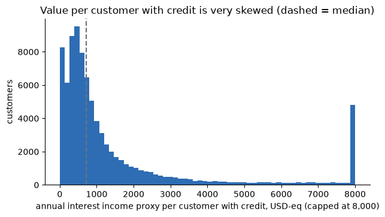
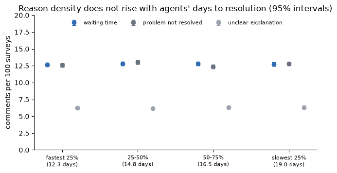

# Opportunity: what a user is worth, what churn costs, and what the surveys can (not) tell us

_Last updated: 2026-09-29 · Sections 1-5 and 7-10: code and calculations in [oportunity.ipynb](oportunity.ipynb); every number comes from its executed outputs.
Section 6: code in [call_transcripts/causes.ipynb](call_transcripts/causes.ipynb).
Sources: `customers.csv`, `products.csv`, `service_agents.csv`, the full `transactions`, `complaints`, `satisfaction_surveys` and `call_transcripts` histories (1,097 daily files each, 2023-06-17 to 2026-06-17)._

> Related findings: [compensations / complaints](compensations_hypothesis/FINDINGS.md) · [consolidated opportunities](FINDINGS.md)

---

## TL;DR

| Question | Answer |
|---|---|
| What is a user worth to the platform? | A **floor** of **~993 USD-equivalent a year** of interest income per customer on average (**median 213**; 1,721 for customers with credit), plus **14,127** of balances. It is the same in every segment, tenure and credit-score band. The average hides a very skewed base: the top 10% of customers hold **66%** of the interest income. |
| What does churn cost? | **Churn cannot be identified in this data**: customers marked `Closed` or `Inactive` hold the same value and transact like `Active` ones. At the observed (weak) rates the whole base loses **0.7 M to 4.4 M USD-eq of interest income a year** and **10.5 M to 63.2 M of balances**. |
| What would the customers behind low ratings for *waiting time* or *problem not resolved* cost if they churned? | **15,715 customers** tie **15.6 M USD-eq a year of interest income (10.5% of the base)** and **223.8 M of balances**: 46.9 M over 3 years, 78.2 M over 5, about 156,000 a year for each 1% who leave. This is a **scenario**, not an observed loss. |
| Do those low ratings actually cost anything? | **No measurable cost.** These customers are no more likely to leave, transact less, complain, receive compensation or contact again than customers who gave the top score. Upper bounds: about **51,000** and **39,000 USD-eq a year**, under 1% of the exposure. |
| Main problem with the survey data | The **comment is a function of the rating band**, not independent information, and surveys **cannot be linked** to the complaints or interactions they should evaluate. The "reasons" cannot be verified. |
| New: does the density of comment reasons follow days to resolution? | **No, within what is observed**: at agent, month and customer level (Spearman between -0.07 and +0.08, every interval including zero, one of them only up to 0.00), and also when the never-resolved tail is included. **But no complaint was ever resolved in under a day** and only 22.9% have a resolution time, so the fast end is unobserved (section 5.3). |
| New: do call transcripts or the agent roster show what causes waiting time, and is any agent an AI agent? | **No AI agent is registered** (1,200 human agents; `agent_type` is a channel, not an automation tier). The call's **topic** (`Queja`, `Retención`) and **length** carry a small, real signal, but together they account for only **8.1%** of waiting-time complaints; **92% are unexplained** by anything in the transcript or the agent roster. |

---

## 1. What is a user worth?

**Definition (a floor, not a lifetime value).** The files hold no revenue, fees or margin. Value is built from what exists:

- **Annual interest income proxy** = credit balance x `interest_rate` (assumed to be an annual percentage). It includes delinquent balances, so it can overstate income.
- **Balances held** (credit and deposits, USD-equivalent at the rates implied by the transactions file: 350 ARS/USD and 4,000 COP/USD, an assumption read off the data). They leave with the customer.
- **Activity, tenure, segment, credit score and status** from `customers.csv`.

Fees, interchange, deposit margins, cost of funds, default losses and acquisition cost are **not in any file**.

### 1.1 Per customer, by segment (150,000 customers)

| | Basic | Plus | Premium | Student | All |
|---|---:|---:|---:|---:|---:|
| Customers | 89,756 | 37,547 | 15,207 | 7,490 | 150,000 |
| With a credit product | 57.7% | 57.9% | 57.8% | 57.1% | 57.7% |
| **Annual interest income proxy, mean (USD-eq)** | 997 | 984 | 1,001 | 978 | **993** |
| Annual interest income proxy, median | 213 | 216 | 216 | 190 | 213 |
| Credit balance, mean | 8,464 | 8,359 | 8,505 | 8,307 | 8,434 |
| Deposit balance, mean | 5,700 | 5,706 | 5,584 | 5,769 | 5,693 |
| Transactions in the last 12 months, mean | 9.9 | 9.9 | 9.8 | 9.8 | 9.9 |
| Tenure (years), mean | 4.0 | 4.0 | 4.0 | 4.0 | 4.0 |
| Credit score, mean | 600 | 699 | 797 | 649 | 647 |

Among the 86,561 customers with a credit product, the annual interest income proxy is **1,721 on average (median 714)**. The whole base holds about **149.0 M USD-eq of
annual interest income** and **2,119 M of balances** (14,127 per customer).

### 1.2 The average hides a very skewed base

| Percentile of customers | 10% | 25% | 50% | 75% | 90% | 99% |
|---|---:|---:|---:|---:|---:|---:|
| Annual interest income proxy (USD-eq) | 0 | 0 | 213 | 842 | 2,325 | 12,337 |
| Total balances (USD-eq) | 0 | 2,941 | 7,129 | 13,054 | 22,829 | 138,154 |

**42.3% of customers have no credit and therefore no interest income in this proxy**, and the **top 10% of customers hold 66.2% of the base's interest income**. The
typical customer is worth far less than the mean, so a churn cost priced at "993 a head" overstates the typical loss and understates the loss of the few large customers.

### 1.3 What does and does not move value

| Attribute | Result |
|---|---|
| Segment | No difference (mean interest income 978-1,001): `Premium` is not worth more than `Basic` |
| Tenure band (under 2, 2-4, 4-6, 6-8 years) | 991 / 987 / 993 / 1,003 (flat) |
| Credit-score band | 968 (no score) to 1,014, no trend; Spearman with value 0.00 |
| Tenure | Spearman -0.00 with value |
| Activity (transactions in the last 12 months) | Spearman 0.39 with interest income and 0.61 with balances |

Activity is the only attribute that moves with value; it most likely reflects customers with more products holding more and transacting more, which was not tested here.

---

## 2. What does churn cost?

### 2.1 Churn cannot be identified

| Status | Customers | Mean interest income | Mean deposits | Transactions a year |
|---|---:|---:|---:|---:|
| Active | 127,700 | 999 | 5,695 | 9.86 |
| Inactive | 14,914 | 966 | 5,692 | 9.79 |
| Suspended | 4,407 | 925 | 5,631 | 9.80 |
| **Closed** | **2,979** | **1,001** | **5,702** | **9.77** |

Customers marked `Closed` still hold the same balances and interest income as active ones and still transact about 9.8 times a year. `customer_status` also has no date. So status
does not tell us who left, and **a measured churn rate does not exist**. The best available approximation divides the status counts by the 600,153 customer-years observed (registration to 2026-06-17):

| Definition of churn | Annual churn rate | Interest income lost a year (whole base) | Balances leaving a year (whole base) |
|---|---:|---:|---:|
| `Closed` | 0.50% | 0.74 M USD-eq | 10.5 M |
| `Closed` or `Inactive` | 2.98% | 4.44 M USD-eq | 63.2 M |

These are weak numbers: they are upper-level approximations of a quantity the data cannot measure.

### 2.2 The cost of one churned user

Each customer who leaves takes their interest income and balances with them: **993 USD-eq a year and 14,127 of balances on average**, **1,721 and (median) 714 if they have credit**, and
**213 for the median customer** (whose median balances are 7,129). Over horizons, an average user is worth about **3.0 K USD-eq of interest income in 3 years and 5.0 K in 5 years**
(undiscounted, no other revenue, no replacement cost).

---

## 3. The customers behind low ratings for waiting time or problem not resolved

Scope: CSAT and CES surveys (both scale 1-4, so "rated above 3" is exactly the top score 4), last 12 months (2025-06-01 to 2026-05-31). Customers are grouped by the
reason in their comment; the baseline is customers who gave the **top score (4)**.

### 3.1 Exposure: what is tied to them (not what is lost)

| Reason | Customers | Interest income tied, per year | Credit balance | Deposits | Per customer |
|---|---:|---:|---:|---:|---:|
| Waiting time | 8,086 | 7.9 M | 67.7 M | 45.8 M | 980 |
| Problem not resolved | 8,079 | 8.2 M | 71.6 M | 45.3 M | 1,011 |
| Unclear explanation | 4,168 | 4.2 M | 35.9 M | 23.4 M | 996 |
| Rated 1-3, no reason recorded | 21,296 | 21.2 M | 180.3 M | 121.2 M | 997 |
| Top score (4), for comparison | 5,534 | 5.6 M | 48.5 M | 31.4 M | 1,015 |
| **Waiting time or not resolved (each customer once)** | **15,715** | **15.6 M** | **135.2 M** | **88.6 M** | 995 |

These customers are **not more or less valuable** than others (about 995 each, the same as the base).

### 3.2 A full-churn scenario (not what the data shows)

If every one of the **15,715 customers** behind these ratings left:

| | Value |
|---|---:|
| Annual interest income lost | **15.6 M USD-eq (10.5% of the whole base)** |
| Over 3 years / 5 years (undiscounted) | 46.9 M / 78.2 M |
| Balances that leave | 223.8 M (135.2 M credit, 88.6 M deposits) |
| Per 1% of them who leave | about 156,000 a year |
| Expected annual loss at the observed (weak) churn rate of 2.98% | about 466,000 a year, **not attributable to the ratings** |

By reason: waiting time 7.9 M a year and problem not resolved 8.2 M a year (5.3% and 5.5% of the base's interest income).

### 3.3 Observed consequences: do these customers behave differently afterwards?

Only a difference from customers who gave the top score could be attributed to the rating. None appears.

| Outcome | Waiting time | Problem not resolved | Top score (4) |
|---|---:|---:|---:|
| Status other than `Active` (today) | 15.00% | 14.83% | 15.05% |
| Change in transactions, 3 months after vs before the survey (difference vs top score) | +0.02 (+/-0.05) | -0.02 (+/-0.05) | 0 |
| Filed a complaint in the next 90 days | 3.50% | 3.78% | 3.33% |
| Compensation in the next 90 days, per survey (raw units) | 0.66 | 0.75 | 0.78 |
| Another survey within 30 days (repeat contact) | 3.88% | 3.78% | 3.68% |

### 3.4 Cost bound

| | Waiting time | Problem not resolved |
|---|---:|---:|
| Extra compensation per survey (raw units) | -0.12 (+/-0.32) | -0.03 (+/-0.33) |
| Extra compensation over 12 months (raw units) | -967 (+/-2,687) | -252 (+/-2,719) |
| Extra share not `Active` (points) | -0.05 (+/-0.70) | -0.22 (+/-0.69) |
| **Upper bound of interest income at stake from extra churn (USD-eq a year)** | **51,226** | **38,818** |
| As a share of the exposure | 0.65% | 0.48% |

Compensation has **no currency column**, so it is in raw units. Every difference is indistinguishable from zero, so the **attributable cost is zero, with these upper bounds**.

---

## 4. The main problem with the survey data (comment and rating)

**The comment carries no independent information: it is a function of the rating band, and the surveys cannot be tied to the operations they should evaluate.** Evidence:

| Finding | Evidence |
|---|---|
| Comments follow the rating band exactly | All **67,477** comments on ratings of 1-3 (100%) are one of five negative sentences; **0 of 33,719** comments on ratings above 3 is negative |
| Sentiment is also set by the band | `Negative` only on ratings 1, 2 and 3 (2,485 / 22,045 / 42,999), `Neutral` on 4-7, `Positive` only on the top CSAT/CES score 4 (6,954) |
| Comment and sentiment are not consistent with each other | 5,079 surveys have a sentiment but no comment; 5,018 have a comment but no sentiment |
| Having a comment does not depend on the rating | 47.2% to 48.3% of surveys carry a comment at every rating from 1 to 7 |
| The reason split does not move with the rating | Waiting 40.2 / 40.4 / 40.1%, not resolved 38.7 / 39.9 / 40.2%, unclear 21.2 / 19.8 / 19.7% for ratings 1 / 2 / 3 |
| Only 13 different sentences in 212,759 surveys | Five negative, three neutral, five positive |
| The follow-up answers do not agree with the comments | Mean answer 3.01 for both rating bands on attention and on wait time (1-5 scale); customers whose comment complains about waiting rate "was the waiting time acceptable?" **3.00**, the same as for the other themes (3.00 and 3.04) |
| Different scales by survey type | CSAT and CES run 1-4, NPS 2-7 (no Promoter is possible, implied NPS -74.5) |
| No link to the complaint or interaction | `origin_interaction_id` is empty in all 67,095 complaints; a survey after a complaint has the same agent only 0.11% of the time (chance) |

**Consequence for this analysis.** The reasons ("waiting time", "problem not resolved") are a relabelling of low ratings, so **any cost attributed to those reasons cannot be verified**, and
the survey cannot say which operational failure produced them. It is also why no consequence (churn, activity, complaints, compensation, repeat contact) differs between reasons.

---

## 5. New: does the density of comment reasons follow days to resolution?

**Density** is the number of comments of a reason per 100 surveys of a unit. **Days to resolution** exists only in complaints (resolved cases). With no interaction key, three levels of link were tested:
across the **1,084 agents** present in both files, across **35 calendar months**, and for **surveys filed within 90 days after a resolved complaint of the same customer**. If slow
resolution produced waiting or unresolved comments, density would rise with days to resolution at the level tested.

### 5.1 Agents (1,084 agents, median 194 surveys and 12 resolved complaints each)

| Agents by speed of resolution | Mean days to resolution | Waiting time per 100 surveys | Problem not resolved per 100 | Unclear explanation per 100 |
|---|---:|---:|---:|---:|
| Fastest 25% | 12.3 | 12.64 | 12.61 | 6.26 |
| 25-50% | 14.8 | 12.80 | 13.03 | 6.20 |
| 50-75% | 16.5 | 12.79 | 12.38 | 6.34 |
| Slowest 25% | 19.0 | 12.76 | 12.77 | 6.29 |

Each quartile has about 53,000 surveys (interval +/-0.28 per 100 for waiting time). **Agents 54% slower to resolve (19.0 vs 12.3 days) have the same density of every reason.**

### 5.2 Correlations, by level

| Level | Pairs | Waiting time | Problem not resolved | Unclear explanation |
|---|---:|---:|---:|---:|
| Across agents (density vs mean days) | 1,084 | 0.02 (-0.04 to 0.08) | -0.00 (-0.06 to 0.06) | 0.01 (-0.05 to 0.07) |
| Across months (density vs mean days) | 35 | 0.06 (-0.28 to 0.38) | 0.08 (-0.26 to 0.40) | -0.07 (-0.40 to 0.27) |
| Customer window (has the reason vs days to resolution) | 1,756 surveys (1,631 customers) | 0.02 (-0.02 to 0.07) | -0.03 (-0.07 to 0.02) | -0.04 (-0.09 to 0.00) |

Customer window, by the resolution time of the customer's complaint (0-10 / 10-20 / 20-30 days): waiting time 12.4 / 11.3 / 14.3 per 100 surveys (+/-2.7), not resolved 12.4 / 13.0 /
10.8, unclear 7.0 / 7.2 / 4.5. Nothing rises with days to resolution. The only borderline value (unclear explanation, -0.04) points the **opposite way** to what a real link
would give.

**Reading.** Comment-reason density is **unrelated to days to resolution** at every level tested, **within the observed range of 1-30 days** (see 5.3 for the limits). Combined with section 4, the reasons neither corroborate nor track the operation they claim to describe.
The customer-window test has low power (1,756 surveys) and the month test very low (35 points), but the agent test (1,084 agents, about 53,000 surveys per quartile) is large enough that a
real dependence of even a fraction of a point per 100 surveys would have shown.

---

### 5.3 Range restriction and selection: no fast resolutions, and an unresolved tail that was left out

A fair objection to sections 5.1 and 5.2: if every complaint took more than a day, the data holds **no positive observation of fast resolution**, so a flat relationship says
nothing about what happens below the observed range. And the tests above used only complaints that have a resolution time. Both were measured.

| Fact | Value |
|---|---:|
| Complaints | 67,095 |
| With a resolution time (resolved or closed) | 15,363 (**22.9%**) |
| Without one (open, in process, escalated, rejected or missing) | 51,732 (77.1%) |
| Fastest resolution recorded | **1 day** (smallest gap creation to resolution: **24.00 hours**) |
| Resolved in **less than 1 day** | **0** |
| Resolved in exactly 1 day / in 3 days or less | 495 / 1,517 |
| Slowest resolution recorded | 30 days |

So the objection holds: **the fast end is unobserved**, and the slow end stops at 30 days. Only `Resolved` and `Closed` cases carry a resolution time, a rating or a compensation.

**The unresolved tail, included.** Density of each reason in the 90 days after a complaint, by how the complaint ended:

| How the complaint ended | Surveys | Waiting time per 100 | Problem not resolved per 100 | Unclear explanation per 100 |
|---|---:|---:|---:|---:|
| Resolved in 1-3 days | 179 | 13.97 (+/-5.1) | 8.94 (+/-4.2) | 9.50 (+/-4.3) |
| Resolved in 4-10 days | 379 | 11.61 (+/-3.2) | 13.98 (+/-3.5) | 5.80 (+/-2.4) |
| Resolved in 11-20 days | 569 | 11.25 (+/-2.6) | 13.01 (+/-2.8) | 7.21 (+/-2.1) |
| Resolved in 21-27 days | 424 | 13.68 (+/-3.3) | 11.79 (+/-3.1) | 4.72 (+/-2.0) |
| Resolved in 28-30 days | 205 | 15.61 (+/-5.0) | 8.78 (+/-3.9) | 3.90 (+/-2.7) |
| **Never resolved (open, in process, escalated)** | **5,592** | **12.86 (+/-0.9)** | **12.71 (+/-0.9)** | 6.56 (+/-0.7) |
| Rejected | 82 | 15.85 (+/-7.9) | 13.41 (+/-7.4) | 4.88 (+/-4.7) |

| Comparison | Waiting time (points per 100) | Problem not resolved | Unclear explanation |
|---|---:|---:|---:|
| Never resolved vs resolved in 1-30 days | +0.16 (+/-1.79) | +0.70 (+/-1.75) | +0.41 (+/-1.30) |
| Resolved in 28-30 days vs resolved in 1-3 days | +1.64 (+/-7.10) | -0.16 (+/-5.70) | -5.59 (+/-5.05) |

Customers whose complaint was **never resolved** (5,154 customers, open for up to three years) do not cite "problem not resolved" or "waiting time" more than customers whose complaint was resolved.
Across the 1,090 agents, the share of an agent's complaints still unresolved (mean 65%) is unrelated to the density of any reason (Spearman -0.03, +0.03 and -0.04, every interval including zero).

**What can and cannot be concluded.**

- Within **1-30 days** and for the **never-resolved tail**, reasons do not track resolution time; the tail comparison is well powered (about +/-0.9 points per group).
- The **fast end (under one day) is unobserved**: nothing in this data says what same-day or first-contact resolution would change, and it is the outcome an agent would target.
- The **extremes are thin** (179 surveys at 1-3 days, 205 at 28-30): only differences of 5-7 points per 100 surveys could be detected.
- The absence of a relationship is therefore **not proof that speed does not matter**. Answering it needs hour-level resolution times, cases resolved at first contact, and a survey tied to the case.

---

## 6. Call transcripts and the agent roster: what explains waiting time, and is any agent an AI agent?

**Scope.** `call_transcripts` (171,321 transcripts, 2023-06-17 to 2026-06-17, streamed) joined to `satisfaction_surveys` by `interaction_id` (53,090 linked, 31.0% of transcripts, always the
same customer and agent) and to `service_agents.csv` (1,200 agents) by `agent_id`. Full detail and every check in [call_transcripts/causes.ipynb](call_transcripts/causes.ipynb).

### 6.1 Is any agent an AI agent? No.

`agent_type` has four values (`Phone`, `Digital`, `In-Person`, `Hybrid`), all describing a **channel a human works**, not an automation tier. Every one of the 1,200 rows carries a human first
and last name, a hire date (2013-06-20 to 2026-03-17), a native accent and a country of origin matching each other 1:1 (Mexico 600, Colombia 360, Argentina 240), and no automation keyword
(`bot`, `virtual`, `chatbot`, `asistente`, `automat-`, `IA`, `AI`) appears in any name, email or specialty. `Digital` (251 agents) is a human agent assigned to digital-channel contacts, not a bot.

The roster's own **`avg_csat`** (mean 4.27, range 3.50-5.00) and **`total_monthly_interactions`** (mean 453, range 100-800) are flat across `agent_type`, `experience_level`, `specialty`,
`work_shift` and `agent_status`, and are **unrelated to what the transcripts and surveys actually record**: Spearman ~0.00 against the observed monthly call rate and ~0.01 against the
observed mean CSAT of that agent's linked surveys. The roster cannot be used as a performance proxy; only the joined, observed figures below can.

### 6.2 What explains waiting time and unresolved-problem comments?

The transcript text is a fixed template (12 distinct lines across the whole history; every call asks for a balance) and carries no complaint or technical content, even though 17% of calls
are labeled `Queja` and 15% `Técnico`. Two real, if modest, signals survive against that template:

- **Topic.** `Queja` and `Retención` calls have the lowest CSAT (2.44 and 2.60 against 2.91 for `Transaccional`) and the most waiting-time (+3.1 and +3.3 per 100 surveys) and unresolved
  (+1.9 and +1.8) comments. They also take disproportionate call time: `Queja` is 17.1% of timed calls but 23.1% of call time (1.35x), `Comercial` 8.1% of calls and 13.5% of time (1.68x).
- **Length.** Across all calls, longer means a lower rating (CSAT 2.89 to 2.60 by duration quartile, Spearman -0.16) and more waiting complaints (11.6 to 14.5 per 100 surveys). But **inside a
  topic, length no longer predicts the rating** (e.g. `Queja` shorter/middle/longer third: CSAT 2.44/2.43/2.47) — the rating effect is really the topic. The **waiting-time comment** does keep a
  small length gradient inside topics (e.g. `Queja` 14.0/14.6/15.2 per 100 by call-length tercile).

**How much do topic and length explain?** If every topic complained about waiting at the `Transaccional` rate, there would be 6,232 waiting-time complaints instead of the observed 6,783 —
topic accounts for **551, or 8.1%**. **Not signals at all**: the agent roster (section 6.1), the agent handling the call (spread of agents' mean duration 13.0 s vs 13.3 s expected by chance;
spread of agents' waiting-complaint rate 4.79 vs 4.83 points expected), audio quality, transcription model, accent, product mentioned, entity counts, the customer asking how long it takes, the
agent asking them to wait, having called in the previous 30 days (3.4% vs 3.2%), or calling again afterwards (3.2% vs 3.2%).

**Why so little is explained.** The waiting-time complaint (`Tardaron mucho en atenderme`, `Tuve que esperar demasiado tiempo`) refers to waiting *before or around* the call, which the
transcripts do not record (duration is talk time only); and the topic label does not agree with the call's actual text (Cramer's V 0.01), so a `Queja` call's real content is unobservable here.

---

## 7. What this means for the opportunity

- **Value at stake is large; observed cost is zero.** The customers behind waiting-time and unresolved-problem ratings tie about 15.6 M USD-eq of yearly interest income and 223.8 M of balances, but nothing in the data shows that the ratings
  make anyone leave, spend less or need more service.
- **A user is worth a floor of ~993 USD-eq a year, but the typical user is worth ~213** (median), and a tenth of the customers hold two thirds of the income. Retention efforts priced on the mean would
  target the wrong users; the value lies in the few large ones.
- **The waiting-time versus not-resolved split cannot guide investment.** It cannot be verified (section 4), it does not follow resolution speed within 1-30 days (section 5) and it does not predict any consequence (section 3.3). What same-day resolution would change is **unobserved** (section 5.3).
- **Churn cost cannot be measured yet** because churn is not identifiable.
- **No AI agent is registered**, and neither the call's topic and length nor the agent roster explain more than 8.1% of the waiting-time complaints: the transcripts and the roster are not, today, a usable signal for routing or staffing decisions aimed at reducing waiting time.

---

## 8. Assumptions and limits

- **Interest income is a proxy**: credit balance x `interest_rate` (assumed annual %); it includes delinquent balances. Deposit margins, fees, interchange, cost of funds, defaults and acquisition cost are missing, so **value is a floor** and no profit is stated.
- **USD-equivalent** amounts use the exchange rates implied by the transactions file (350 ARS/USD, 4,000 COP/USD), not market rates.
- **Compensation has no currency**, so it is in raw units.
- **`customer_status` has no date**; the "observed churn rates" are approximations, not measurements.
- **Full-churn figures are scenarios** (all customers behind a reason leave), not forecasts. Multi-year figures are undiscounted.
- **Surveys are per interaction and complaints per case** with no shared key, so section 5 links them by agent, month and customer window only.
- **Range restriction and selection.** No complaint was resolved in under a day (fastest exactly 1 day, slowest 30) and only 22.9% of complaints have a resolution time, so every speed-related result holds only inside 1-30 days among resolved complaints (section 5.3).
- The data looks generated independently of business behaviour (uniform durations, 13 comment sentences, flat rates), so relationships found or not found here should be reproduced on real operational data.
- **Call transcripts are a fixed template** (12 distinct lines) and carry no real complaint or technical content, and **the agent roster's own performance columns do not match observed behaviour**, so section 6 describes what the topic and length labels correlate with, not a verified cause.

## 9. What to collect to quantify this properly

1. **Revenue and margin per customer** (fees, interchange, deposit spread, cost of funds, defaults) and **acquisition cost**, to turn the floor into a customer lifetime value.
2. **A dated closure or inactivity event** per customer, to measure churn and its timing after a low rating.
3. **A survey-to-interaction-to-complaint key** (`origin_interaction_id` or a `complaint_id` on the survey) and the **survey denominator** (interactions surveyed vs answered).
4. **Real comments** and a **valid 0-10 NPS**, so that reasons carry information beyond the rating.
5. **Handling time and cost per contact**, to price repeat contacts and waiting time directly.
6. **Compensation currency**, to compare it with revenue.
7. **Queue and hold time per interaction**, real (non-templated) conversation content, and a resolution outcome per interaction, plus the `call_center_interactions` dataset the catalog lists, to find what actually drives waiting time.

## 10. Reproduce

[oportunity.ipynb](oportunity.ipynb) loads customers, products, complaints and surveys, and **streams the 1,097 transaction files one at a time** (peak process memory about 630 MB, about 40 seconds).
It contains: value per user, churn rates and the value held by status, exposure and full-churn scenarios, the consequence tests and cost bounds, the survey comment-versus-rating checks, and the
reason-density versus days-to-resolution tests. Charts in `figures/` are exported from the executed notebook.

[call_transcripts/causes.ipynb](call_transcripts/causes.ipynb) streams the 1,097 transcript files, joins to surveys and to `service_agents.csv`, and contains: the AI-agent check, roster stats, the topic/duration/text grouping analysis, the waiting-time-complaint deep dive, and the agent-roster-versus-outcomes checks referenced in section 6.
