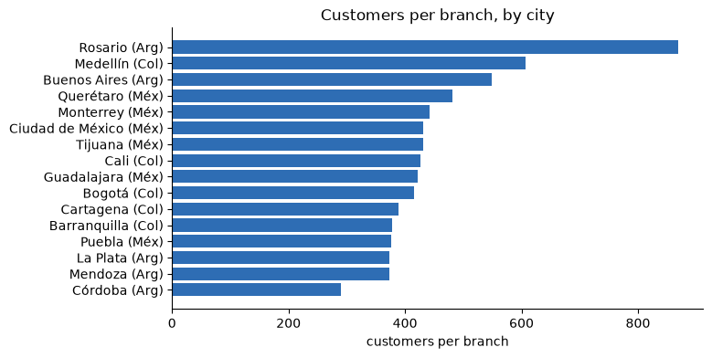
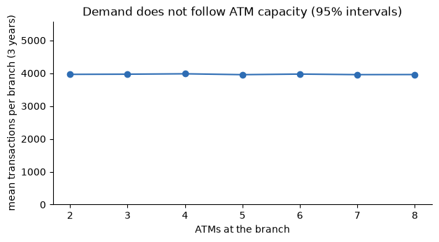
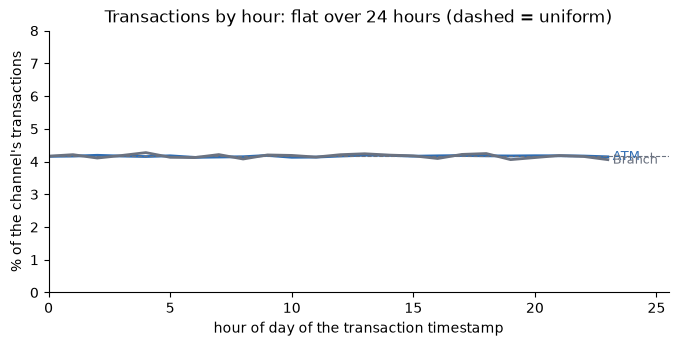
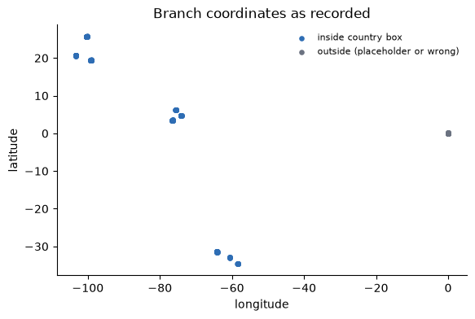

# Findings log: business opportunities in the physical branch network

> **Business opportunities across all hypotheses, graded by evidence:** see [../FINDINGS.md](../FINDINGS.md).

_Last updated: 2026-09-26 · Datasets covered so far: `branches.csv` (350 branches), joined to `products`, `customers`, `complaints` and the full `transactions` history (4,425,008 transactions in 1,097 daily files)_

Every number here comes from the executed notebook [branches.ipynb](branches.ipynb). When another dataset is analysed
(interactions, digital events, staffing...), add a row to the status table and a section below.

---

## TL;DR

| Question | Answer today |
|---|---|
| Does any branch stand out (as a star or a hot spot)? | **No.** Transactions, products opened, complaints and delinquency per branch vary exactly as much as chance predicts, and do not follow branch type, capacity, city, status or age. |
| Is the network balanced with respect to customers? | **No.** Customers per branch range from **290 (Córdoba) to 869 (Rosario), a 3.0x ratio**, although customers are spread evenly across the cities of each country. |
| Does capacity follow demand? | **No.** ATMs per branch range 2-8 but demand per branch is flat, so volume per ATM varies about four-fold purely from how many were installed. |
| Are the branch locations and links usable? | **Largely no.** 167 of 350 coordinates are placeholders, all 175 Mexican branches carry the wrong phone prefix, and customers cannot be linked to a branch. |
| Is there an ATM availability or teller capacity problem? | **No signal in the data.** Failure rates are the same in every channel, and load per ATM and per teller window is far below capacity at every hour and day (section 7). Availability itself (uptime, outages, queues) is not recorded. |
| Can AI-agent automation be sized in money from this file? | **Not yet.** Only volumes exist: 92,098 human-handled jobs in 12 months, worth about 1,535 staff hours per minute of handling time per job. Handling time and labour cost are missing (section 8). |
| Where is the opportunity? | **Repairing the data first**, then validating the density and capacity imbalances and clarifying the 14 `Temporarily Closed` branches. None can be sized in money: the files contain no cost, revenue, footfall or staffing data. |

**Business idea being tested:** the physical network holds opportunities: rebalancing branches, reallocating ATM and teller
capacity, adjusting opening hours, closing or reopening branches, and fixing service hot spots.

---

## 1. Status by dataset

| Dataset | Notebook | Rows | Verdict |
|---|---|---|---|
| `branches.csv` with products, customers, complaints and transactions | [branches.ipynb](branches.ipynb) | 350 branches; 4,425,008 transactions (1,387,932 carry a branch); 400,000 products; 67,095 complaints | Real structural imbalances in the network file; no activity difference between branches; location and link data need repair |

---

## 2. The network as recorded

| | |
|---|---|
| Branches (Mexico / Colombia / Argentina) | 350 (175 / 105 / 70), in 16 cities |
| Branch type | Express 130, Corporate 129, Premium 48, Main 43 |
| ATMs / teller windows | 1,776 / 2,744 (2-8 ATMs and 3-12 windows per branch) |
| `Temporarily Closed` | 14 (4%) |
| Opened between | 1990-01-03 and 2023-05-11 |

Every branch is `Urbana`, has ATMs and has teller windows, so those columns carry no information beyond the counts. Branch names
are not unique (175 distinct names for 350 branches).

### Density: customers per branch by city

Customers are spread almost evenly over the cities of each country (Argentina 5,792-6,081 per city, Colombia 8,956-9,140,
Mexico 12,369-12,643), but branches are not:

| City | Branches | Customers per branch | ATMs per 1,000 customers | Teller windows per 1,000 customers |
|---|---:|---:|---:|---:|
| Córdoba (lowest ratio) | 20 | 290 | 20.4 | 25.4 |
| Buenos Aires | 11 | 549 | 9.3 | 13.4 |
| Medellín | 15 | 607 | 7.3 | 13.8 |
| Rosario (highest ratio) | 7 | 869 | 4.3 | 9.0 |

The extremes are 3.0x apart. Whether it matters depends on whether customers use the branch of their city, which section 6 tests.

---

## 3. Demand per branch: identical everywhere

Transactions carrying a branch (ATM and teller channels) over the full history:

| Check | Result |
|---|---|
| Transactions per branch: mean / spread observed / spread expected from chance | 3,966 / 65.0 / 63.0 |
| Highest branch / lowest branch | 1.11x |
| Mean per branch by ATM count (2 ... 8 ATMs) | 3,964 / 3,970 / 3,981 / 3,955 / 3,973 / 3,956 / 3,959 |
| By branch type (Corporate / Express / Main / Premium) | 3,969 / 3,972 / 3,959 / 3,944 |
| By status (Active / Temporarily Closed) | 3,966 / 3,947 |
| By country (Argentina / Colombia / Mexico) | 3,943 / 3,970 / 3,972 |
| Spearman with ATM count / teller windows / age | -0.06 / -0.01 / 0.01 |

**A branch with 8 ATMs sees the same volume as one with 2**, so ATM transactions per ATM per day range **0.39-1.71** (mean 0.79)
and teller transactions per window per day 0.02-0.12 (mean 0.05). These are relative comparisons only: whether the
transaction file is the complete activity of the bank is not known, so the absolute utilisation should not be quoted.

Other per-branch measures behave the same way (observed spread vs the spread chance alone would give):

| Measure per branch | Mean | Observed | Chance | Ratio |
|---|---:|---:|---:|---:|
| Products opened (any channel) | 1,143 | 33.7 | 33.8 | 1.00 |
| Products opened through the Branch channel | 571 | 22.5 | 23.9 | 0.94 |
| Complaints naming the branch | 54.8 | 7.7 | 7.4 | 1.04 |
| Delinquency rate of credit products opened (points) | 14.97% overall | 1.88 | 1.89 | 1.0 |

The lowest and highest branch delinquency rates (10.6% and 21.0%) are what chance produces with ~358 credit products per branch.

---

## 4. Channels and hours

| Channel | Share of transactions | Share of value (USD-equivalent) |
|---|---:|---:|
| POS | 35.0% | 35.0% |
| ATM | 30.0% | 30.0% |
| Web | 15.0% | 15.0% |
| App | 15.0% | 15.0% |
| **Branch (teller)** | **3.0%** | **3.0%** |
| Transfer | 2.0% | 2.0% |

The **Branch is the opening channel of 50.0% of products** (Web 25.1%, App 19.9%, Call Center 5.0%). In this data the physical
branch is mainly an acquisition channel, and the ATM is the physical transaction channel. The opening branch is also recorded for
products opened by app, web and call center, so it is not necessarily where the customer went.

Transactions happen equally at all 24 hours, so only **39.6% of teller transactions fall inside the branch's opening hours**
(39.5% for ATMs, which are not bound to them). Opening hours are 08:00-09:30 to 17:00-20:00. A teller transaction at 3 a.m. is
not plausible: opening hours **cannot be optimised or even validated** from this data.

---

## 5. The 14 `Temporarily Closed` branches look open

| | Active (336) | Temporarily Closed (14) |
|---|---:|---:|
| Transactions per branch (3 years) | 3,966 | 3,947 |
| Transactions per branch, Jan-May 2026 (per month) | 109 / 103 / 111 / 114 / 114 | 111 / 98.5 / 111 / 115 / 110 |
| Products opened per branch | 1,143 | 1,141 |
| Complaints naming the branch, per branch | 54.7 | 57.4 |

15,967 products were opened at these branches, 13,574 of them still `Active`. Either the closure is not reflected in the activity
data or the status is not reliable; the file has **no closure date** to tell which.

---

## 6. Locations and links: what is usable

| Check | Result |
|---|---|
| Branches with coordinates inside their country | 183 of 350 (Argentina 38 of 70, Colombia 58 of 105, Mexico 87 of 175); 167 are placeholders near (0, 0) |
| Cities with at least one valid coordinate | 9 of 16 (none for Puebla, Tijuana, Querétaro, Barranquilla, Cartagena, La Plata, Mendoza) |
| Spread of valid coordinates inside a city | at most 0.20 degrees (about 22 km): city scale, not street scale |
| Branches with a valid phone prefix | 175 of 350: Argentina 70/70, Colombia 105/105, **Mexico 0/175 (all carry +54)** |
| Customers whose `registration_branch_id` exists in the branch file | **5 of 150,000** (every customer has a different value) |
| Complaints that name a related branch | 28.6%, the same for every category (including `Branch`); its country matches the customer's only 37.9% of the time |
| Products' opening branch exists in the branch file | 100% (all 350 used); in the owner's **country** 100% |
| Products opened at a branch in the owner's **city** | 18.19%, against **18.31% expected if the branch were chosen at random within the country** |
| Products opened before their branch's opening date | 4.77% |

The opening branch is always in the right country but unrelated to the customer's city, so **customers do not use the branch of their
city in this data**, which is why the density imbalance of section 2 shows up in no activity measure.

---

## 7. Is capacity a constraint? (availability and load)

Two questions decide whether extra ATM or teller capacity, or an AI agent that substitutes for it, has anything to solve. A second
streaming pass over the 1,097 files measured them. The file has no outage log, queue length or waiting time, so the checks use
failure rates and load per unit of capacity.

**Availability proxies: failure rates are the same in every channel.**

| Channel | Approved | Declined | Pending | Reversed |
|---|---:|---:|---:|---:|
| POS | 91.98% | 5.00% | 2.00% | 1.02% |
| ATM | 92.00% | 4.99% | 1.99% | 1.01% |
| Web | 91.98% | 5.02% | 1.99% | 1.01% |
| App | 92.02% | 4.96% | 2.00% | 1.01% |
| Branch (teller) | 92.06% | 5.06% | 1.93% | 0.94% |
| Transfer | 91.88% | 5.12% | 2.02% | 0.98% |

The response codes are card and balance reasons (`05`, `14`, `51`, `54`, about 1.9% each; `00` about 87.4%; about 5% empty), equal across channels. None is an
equipment or network outage, so **ATM unavailability is invisible in this data**: an availability measure (uptime, out-of-service or
out-of-cash events) is not recorded.

**Load per unit of capacity (all 383,950 branch-days over the full history):**

| | ATM (per ATM) | Teller (per window) |
|---|---:|---:|
| Branch-days with no transaction | 5.1% | 72.3% |
| Median per unit per day | 0.62 | 0.00 |
| 95th percentile | 2.00 | 0.25 |
| 99th percentile | 3.00 | 0.40 |
| Maximum | 7.00 | 1.67 |
| Branch-hours with at least one transaction | 12.75% | 1.36% |
| Busiest branch-hour ever recorded | 5 transactions | 3 transactions |
| Busiest hour of each branch, per unit (mean / max) | 0.81 / 2.00 | 0.30 / 1.00 |

**Calendar pattern.** Monday to Friday run at 111-114% of the daily average and **Saturday and Sunday at about 67-68%** (about 60% of a weekday) (ATM and teller alike).
Load is flat across the days of the month (lowest 93%, highest 105% of the average): there is no payday or month-end peak.

**Reading.** On this data there is no capacity shortage to relieve, at ATMs or at tellers, at any hour, weekday or branch. This holds only if
the transaction file is the complete activity of the bank, which is not known.

---

## 8. AI-agent lens (preliminary): what can be sized today

**Your two examples, against the evidence.**

| If the problem were... | What the data shows |
|---|---|
| ATM availability too low | No sign: failure rates equal to other channels, no outage data, and ATM load is 0.62 transactions per ATM per day at the median (maximum 7) |
| Too few tellers for the demand | No sign: 72.3% of branch-days have no teller transaction, the busiest teller hour recorded has 3 transactions, and no branch exceeds 1.0 per window in its busiest hour |

**Human-handled job pools visible today** (last 12 months, 2025-06-01 to 2026-05-31). This is a **volume** comparison only.

| Job pool | Jobs in 12 months | Per business day (whole bank) | Staff hours a year per minute of handling time per job |
|---|---:|---:|---:|
| Teller transactions (Branch channel) | 41,999 | 115.1 | 700 |
| Products opened through the Branch channel | 25,122 | 68.8 | 419 |
| Complaints received via the Call Center | 11,321 | 31.0 | 189 |
| Complaints received via Web / App | 5,540 | 15.2 | 92 |
| Complaints received via Email | 4,490 | 12.3 | 75 |
| Products opened through the Call Center | 2,514 | 6.9 | 42 |
| Complaints received at a Branch | 870 | 2.4 | 14.5 |
| Complaints received from the Regulator | 242 | 0.7 | 4 |
| **All human-handled pools above** | **92,098** | | **1,535** |
| ATM transactions (self-service, for reference) | 422,052 | 1,156.3 | n/a |

A branch sees about a third of one teller transaction (0.33) and a fifth of a product opening (0.20) per day. The file that likely
holds the biggest pool, `call_center_interactions`, is not available yet.

**The money that is visible in the data today** (none of it is a saving):

| Item | Value | Nature | Source |
|---|---|---|---|
| Delinquent credit balance | ~181.8 M USD-equivalent, ~153.9 M on `Active` products | Exposure / cash flow at stake, not a cost | `delinquency_hypothesis/` |
| Compensation granted on complaints | 1,174,810 raw units over three years (currency unknown) | Direct cost tied to complaint handling | `compensations_hypothesis/` |
| Value passing through the teller channel / ATMs | 222.5 M / 2,223.6 M USD-equivalent over three years | Transaction flows, not revenue or cost | `branches.ipynb` section 5 |
| Labour cost of the 92,098 jobs a year | **cannot be computed** | Handling time and wage are not in any file | n/a |

**How a saving would be sized (arithmetic, with inputs the data lacks).**

`annual saving = jobs per year x share the agent can resolve x minutes per job x cost per minute - cost of running the agent`

Only *jobs per year* exists today. Every other term has to come from outside the files.

**Preliminary reading.** On this file, the automation case is **not** an ATM or teller capacity problem. The measurable candidates are
(1) the cost of handling the human jobs (volume known, cost unknown), and (2) value or exposure elsewhere in the bank, such as
delinquent balance and compensation, which belong to other analyses. Which of them is worth the most cannot be ranked in money until the
missing inputs arrive.

---

## 9. Business opportunities (graded)

| # | Opportunity | Grade | What the data supports | What it cannot tell us |
|---|---|:---:|---|---|
| **P1** | **Repair location and link data** (coordinates, Mexican phone prefix, customer-to-branch and complaint-to-branch links, closure date) | Prerequisite | 167 of 350 coordinates unusable; 7 of 16 cities without any; 175 wrong phone prefixes; 5 of 150,000 customers linkable; 28.6% of complaints name a branch | Whether the underlying values are recoverable |
| **B1** | **Validate and, if real, rebalance branch density** across cities | B | Customers per branch range 290-869 (3.0x); ATMs per 1,000 customers 4.3-20.4 | Whether customers use their city's branch (they do not, in this data) and whether the imbalance hurts service; no geography to draw catchments |
| **B2** | **Reallocate or standardise ATM and teller capacity** | B | 2-8 ATMs per branch with flat demand: volume per ATM 0.39-1.71 per day; teller windows 0.02-0.12 per day | Whether the transaction file is complete; cost of capacity |
| **B3** | **Clarify the 14 `Temporarily Closed` branches** | A (verify status) | Activity, products opened and complaints are unchanged; 15,967 products opened there, 13,574 `Active` | The closure date or whether they are really closed |
| **B4** | **Reassess the role of the branch**: acquisition rather than transactions | B | Teller channel is 3.0% of transactions and value, ATM 30.0%; the Branch opens 50.0% of products | Whether branch-opened products are more valuable; branch cost |

**Not supported by the data** (no business case can be built on these here):

| Idea | Why not |
|---|---|
| Ranking branches (stars, hot spots, closures by performance) | Every measure varies as much as chance across branches |
| Branch-type strategy (Main / Premium / Corporate / Express) | No difference in volume, products, complaints or delinquency by type |
| Optimising opening hours | Transactions are spread over 24 hours; only 39.6% of teller transactions fall inside opening hours |
| Underwriting or collections by branch | Delinquency by opening branch: spread 1.88 vs 1.89 by chance |
| Geospatial or catchment analysis | 48% placeholder coordinates, no coordinates for 7 cities, city scale where valid |
| Linking customers to "their" branch | `registration_branch_id` matches 5 of 150,000; opening branch is unrelated to the customer's city |

---

## 10. Assumptions and caveats

- **Descriptive only:** no model. Group differences are judged against 95% intervals and against the spread chance alone would give.
- **Transactions with a branch** are only the ATM and teller channels (1,387,932 of 4,425,008); other channels carry no branch.
- **Completeness of the transaction file** is unknown, so per-ATM and per-window volumes are comparisons between branches, not absolute utilisation.
- **USD-equivalent** amounts use the exchange rates implied by the transactions file (350 ARS/USD, 4,000 COP/USD), an assumption read off the data.
- **Coordinate validity** uses rough country bounding boxes (Mexico lat 14-33, lon -118.5 to -86; Colombia lat -4.5 to 13.5, lon -79.5 to -66.5; Argentina lat -55.5 to -21.5, lon -74 to -53).
- **The data looks generated independently** of business behaviour (uniform hours, chance-level spreads, the same wrong +54 phone prefix seen in customers' phones); findings about relationships should not be assumed to transfer to production data.

---

## 11. Next steps

1. **Repair** coordinates, Mexican phone prefixes, the customer-to-branch link and the complaint-to-branch attribution, and add a closure date for `Temporarily Closed` branches.
2. **Confirm** whether the transaction file is the complete activity, so ATM and teller utilisation can be read in absolute terms.
3. **Add cost and staffing data** (branch cost, staff, footfall, revenue). Without it no saving can be computed.
   For AI-agent sizing specifically: **handling time per job type**, **loaded labour cost per hour**, the **share of jobs an agent could resolve**, volumes from `call_center_interactions` and `digital_events`, **ATM uptime, out-of-service and cash events**, teller staffing and queue or waiting times, and revenue per product or customer.
4. **Datasets listed in the data catalog but not yet analysed**, which would sharpen this hypothesis if they contain what their names suggest (contents not inspected): `call_center_interactions`, `digital_events`, `service_agents`, `call_transcripts`, `marketing_campaigns`, `campaign_sends` and `daily_exchange_rates` (which would replace the implied exchange rates).

### Checklist for each new dataset

- [ ] Does it give a reliable location for branches and customers?
- [ ] Does it record footfall, staffing or cost per branch?
- [ ] Does it link customers to the branch they actually use?
- [ ] Does any branch differ from chance in the new measure, or is it flat again?

---

## 12. Reproduce

| Notebook | What it contains |
|---|---|
| [branches.ipynb](branches.ipynb) | Branch file structure and quality, coordinate and phone checks, network density, links to products/customers/complaints, full-history demand per branch (streamed, ~360 MB peak memory), channel mix and hours, closed branches, dispersion of products/complaints/delinquency, capacity and availability checks (second streaming pass, ~400 MB), human-handled job pools, conclusions |

Data lives in `data/branches.csv` and `data/transactions/` at the repo root (git-ignored). The transaction history is streamed one
daily file at a time; charts in `figures/` are exported from the executed notebook, so re-export them if it changes.
